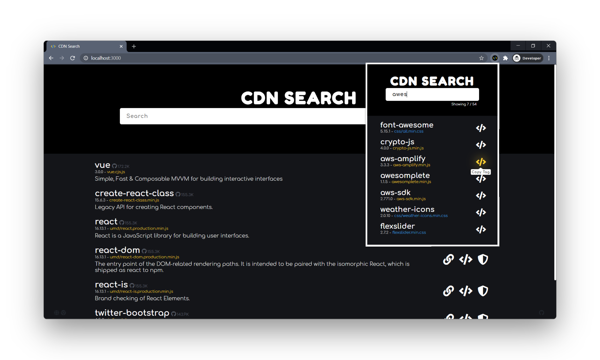

# CDNSearch

Quickly search for libraries/frameworks delivered through CDNs for rapid prototyping. Available as a chrome extension and a website.

### Made with

- React
- [cdnjs API](https://cdnjs.com/api)

## Extension Setup

- Get the latest [release](https://github.com/AravRS/CDNSearch/releases) and unzip its contents.
- Navigate to `chrome://extensions/` or equivalent, from settings of a chromium browser.
- Turn **ON** the developer mode toggle on the top right.
- Click on **Load unpacked** and select the unzipped folder.
